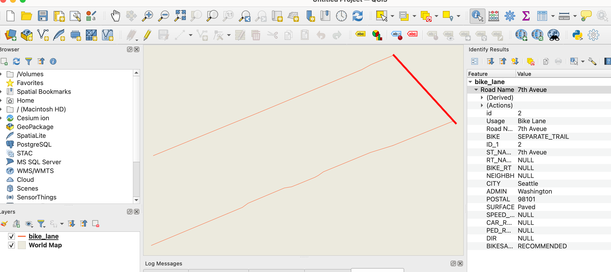

# README

Exploring validation for geospatial features stored in GeoJSON. 🛠

We try to answer these questions about the GeoJSON file:
* *Is it a valid GeoJSON file?*
* *Does it contain valid geometry?*
* *Are the attributes according to what we expect?*

## Validation ✅

This repository shows validation of a GeoJSON dataset, using three approaches:
1. *Format Structure validation using GeoJSON*: checks if format is valid, according to RFC 7946.
2. *Geometry validation using GDAL*: checks if geometry exists and is valid.
3. *JSON Schema validation*: validates against a provided JSON schema file, which also defines how the attributes should look like.

Level 3 is the most complete and most strict type of validation.

You can also validate the geometry and the schema using online tools:
* https://geojsonlint.com/
* https://www.itb.ec.europa.eu/json/geojson/upload
* https://www.jsonschemavalidator.net/
* https://jsonschema.dev/

## Dataset 🗂

The [sample dataset](bike_lane.geojson) was created from an example on the [GMCP page](https://support.google.com/mapcontentpartners/answer/144284#zippy=%2Cbicycle-facilities); it represents bike lanes.



There are several variations of the dataset, to check with the validator:
* `bike_lane.geojson`: valid in every aspect;
* `bike_lane_fail_RFC.geojson`: invalid GeoJSON structure;
* `bike_lane_fail_schema.geojson`: invalid JSON Schema;
* `bike_lane fail_geom.geojson`: invalid geometry;

The [sample schema](bike-schema.json) was created based on the information on section "Bicycle facility fields/attributes" of the same page; it uses [JSON Schema draft-07](https://json-schema.org/).

## Run validation 🎬

Start the notebook with:

```
jupyter notebook
```

Run the different validators.

## License

This project is released under an [MIT License](./LICENSE)

[](https://opensource.org/licenses/MIT)
(dev-exercise-template)